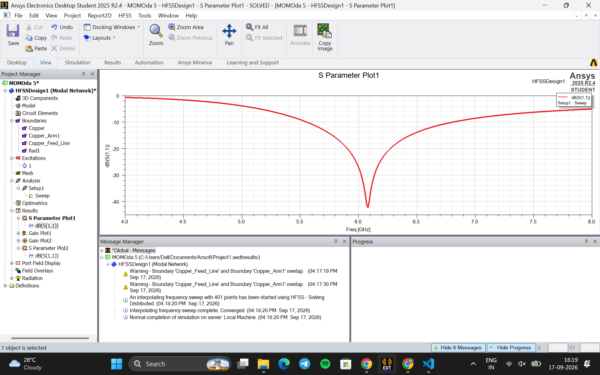
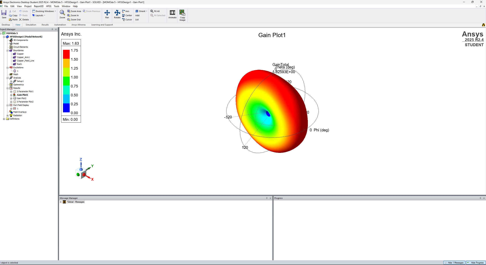
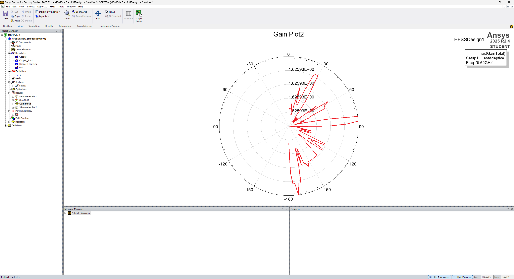

# 5.8 GHz Planar Antenna Design using Ansys HFSS

## Overview

This project presents the electromagnetic design and simulation of a planar antenna operating in the 5.8 GHz frequency range using Ansys HFSS.

The antenna was modeled and analyzed to study impedance matching, radiation characteristics, and gain.

## Objective

- Design a compact planar antenna for operation around the 5.8 GHz band.
- Analyze the antenna using electromagnetic simulation in Ansys HFSS.
- Evaluate S11, radiation pattern, and gain characteristics.

## Software Used

- Ansys Electronics Desktop 2025 R2
- Ansys HFSS
- MATLAB

## Design Parameters

| Parameter | Value |
|---|---|
| Substrate | FR4 |
| Substrate Size | 14 × 14 mm |
| Substrate Thickness | 0.8 mm |
| Port Impedance | 50 Ω |
| Simulation Range | 4–8 GHz |
| Target Frequency | 5.8 GHz |

## Simulation Setup

The antenna was simulated using a 50 Ω lumped-port excitation.

An HFSS frequency sweep from 4 GHz to 8 GHz was used to analyze the antenna response.

The following parameters were evaluated:

- S11 / Return Loss
- Radiation Pattern
- Antenna Gain

## Simulation Results

### S11

The simulated antenna shows a strong resonance around 6.08 GHz with a minimum S11 of approximately -42 dB.



### Radiation Pattern

The simulated radiation pattern was obtained from the HFSS far-field analysis.



### Gain

The antenna gain was evaluated using the simulated far-field radiation results.



## Project Structure

```text
5.8GHz-Planar-Antenna-HFSS/
│
├── HFSS/
│   └── MOMOda 5.aedt
│
├── Results/
│   ├── S11.png
│   ├── Radiation_Pattern.png
│   └── Gain.png
│
├── Documentation/
│   └── Antenna_Simulation_Report.docx
│
└── README.md
